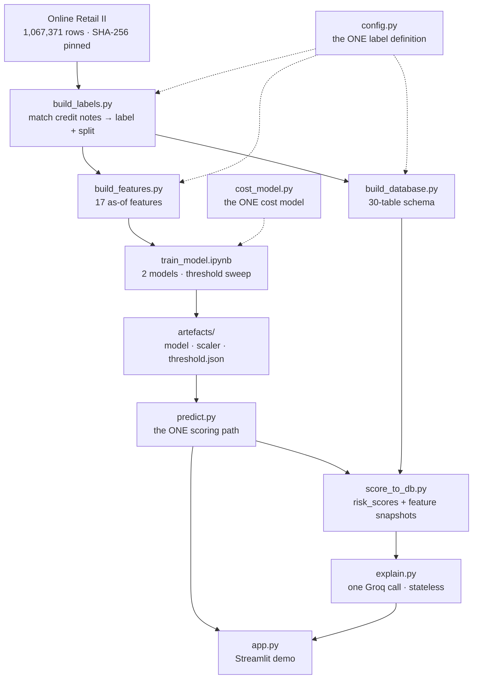

# AI Risk Manager — Return-Risk Scorer

Given an order at the moment it is placed, output the probability it will be returned —
so the merchant can act before absorbing the loss.

The bar this project holds itself to is **honest metrics, including false-positive
cost.** That constraint drove every trade-off in this repo: where a change made the
model look better but the metrics less trustworthy, the change was rejected.

---

## The headline

On 6,070 held-out orders the model has never seen, placed after every training order:

| Metric | Value | Read it against |
|---|---|---|
| **Precision** | 0.330 | 2.02× the 16.33% base rate |
| **Recall** | 0.614 | — |
| **ROC-AUC** | 0.748 | 0.5 is a coin flip |
| **PR-AUC** | 0.375 | 2.30× the base rate |
| **Accuracy** | 0.734 | **flagging nothing scores 0.837** |
| **ECE** | 0.017 | calibration — what makes the cost curve mean anything |
| **Operating threshold** | **0.17** | cost-optimal; not 0.5, not F1-optimal |

```
              predicted keep   predicted return
actually kept        3847              1232
actually returned     383               608
```

**Accuracy is below the do-nothing floor, and that is stated first rather than buried.**
A model that flags nothing is 83.7% accurate on this data. Accuracy is the wrong metric
here, so it is never quoted without the floor beside it. The operating point was chosen
on total cost — see below.

---

## Why the threshold is 0.17, not 0.5

This is the part worth reading. A classifier emits a probability; turning it into a
decision needs a threshold, and that threshold is a **business** choice, not a model
constant. It falls out of what each kind of mistake costs.

```
total = (tp + fp) · review          every flagged order costs analyst time
      +       fp  · friction        a wrongly-flagged good order annoys a customer
      +       fn  · cost_return     a missed return, absorbed in full
      +       tp  · cost_return · (1 − prevention)
                                    a caught return is only sometimes prevented
```

The last two terms are the ones people forget, and leaving them out is not cosmetic.
The naive `fp·c_fp + fn·c_fn` charges nothing to review a true positive and treats every
catch as a prevented return. Under it, the cost-optimal policy was **threshold 0.07,
flagging 81% of all orders** — a number that says far more about the cost ratio than
about the model. Correcting both terms moves the optimum to 0.17, flagging 30%.


The empirical minimum (0.17) lands next to the **analytic break-even** (0.198) that the
cost model implies with no data at all. That agreement is a calibration check, and it is
confirmed independently: ECE 0.017.

### Two order values, not one

A missed return is priced on what *returned* orders are worth (median £388.15). A false
alarm is priced on what *kept* orders are worth (median £285.59). Collapsing them into a
single median misprices both sides.

### What is measured and what is assumed

| | |
|---|---|
| **Measured** on training rows | the two representative order values |
| **Assumed** — industry figures | recovery rate, PSP fee, reverse logistics, review cost, abandon rate, contribution margin, prevention rate |

This dataset contains **no cost data whatsoever**. Every assumed input is a named
variable in [`cost_model.py`](cost_model.py) so a reviewer can argue with the assumption
instead of reverse-engineering a magic number — and the sensitivity analysis shows how
far the operating point actually moves when each one is wrong.


**Report the shape, not the pounds.** "The optimum sits near 0.2, well below the 0.5
default, and moves slowly" survives being wrong about any single constant. The
£138,401 total does not.

---

## Quickstart

```bash
git clone <this repo> && cd ai-risk-manager
python -m venv .venv
source .venv/bin/activate          # Windows: .venv\Scripts\activate
pip install -r requirements.txt

# Phase 1 — data pipeline (downloads ~5.5 MB on first run, SHA-256 verified)
python build_labels.py             # ~1 min
python build_features.py           # ~30 s
python build_database.py           # ~20 s
python test_phase1.py              # 72 checks, must be all green

# Phase 2 — train (CPU; a GPU is slower at this size)
jupyter nbconvert --to notebook --execute --inplace notebooks/train_model.ipynb
python test_model.py               # 26 invariant checks
python evaluate_model.py           # 27 edge cases + the held-out report

# Phase 3 — join the model to the database, then explain
python score_to_db.py
python test_explain.py             # 35 checks, no API key needed

# Phase 4 — the demo
streamlit run app.py
```

For live LLM explanations, copy `.env.example` to `.env` and add a free key from
[console.groq.com/keys](https://console.groq.com/keys). Everything else runs without one.

---

## How it fits together



| File | Role |
|---|---|
| `config.py` | The label definition and every shared constant. Pins the dataset by SHA-256. |
| `build_labels.py` | Matches credit notes to purchases; applies the label window and maturity cutoff; writes the chronological split. |
| `build_features.py` | 17 as-of features. Nothing that had not happened by order time. |
| `build_database.py` | Builds `risk.db` from the 30-table schema; loads nine tables. |
| `cost_model.py` | The one cost model. Imported by the notebook, the evaluator and the app. |
| `notebooks/train_model.ipynb` | Trains both candidates, sweeps the threshold, picks the winner on cost. |
| `predict.py` | The one scoring path. Schema vocabulary; exact per-feature contributions. |
| `score_to_db.py` | Writes scores and feature snapshots into `risk.db`. |
| `explain.py` | The LLM layer. One call, stateless, cached, never decides anything. |
| `app.py` | Streamlit demo — score an order, move the cost sliders, read the evidence. |

---

## The label, and why it is narrower than it looks

An order is **returned** if at least one of its lines is reversed by a credit note raised
**between 1 and 90 days** after the purchase. Both bounds are load-bearing.

- **Lower bound.** 11.1% of matched credit notes land on the same calendar day as the
  purchase. Those are clerical corrections. Without the floor, the model learns to
  predict the retailer's own data-entry errors.
- **Upper bound.** This one was missing at first, and it mattered. Maturity guarantees
  every labelled order 90 days of observation — but the label originally counted returns
  at *any* horizon. So a Dec 2009 order was watched for 667 days and a Sep 2011 order for
  90, and the positive rate rose with the length of the watch:

  ```
  positive rate by observation-window quintile
    17.6%  18.5%  18.3%  18.1%  20.3%     ← "ever returned"      spread 0.027
    16.3%  16.3%  16.9%  16.5%  17.6%     ← "within 90 days"     spread 0.012
  ```

  That is exposure time, not risk. Because the split is chronological, training sat in
  the long-window end and test in the short one, **manufacturing a 1.21pp train/test gap
  out of nothing.** Capping the label at the window maturity already guarantees cut that
  gap to 0.50pp. `test_phase1.py` now fails if this drift reappears.

Orders within 90 days of the data's end are **excluded, not labelled negative** — they
are unresolved, not clean.

```
rows                 1,067,371     Dec 2009 – Dec 2011
no CustomerID            22.8%     excluded: returns unattributable
mature orders           30,347     6,628 immature dropped
POSITIVE RATE           16.73%
split date          2011-04-28     train 24,277 (16.83%) / test 6,070 (16.33%)
```

---

## Leakage discipline

**The one rule:** every feature for an order at time `T` uses only events that had
already *happened* by `T` — measured by when the outcome occurred, not by an earlier
order's eventual label.

- **Chronological splits only.** Never `train_test_split`, never plain k-fold. A random
  split leaks the future into training through the customer-history features.
- **No resampling.** 16.7% positive needs no SMOTE, and rebalancing would distort the
  calibrated probabilities the entire cost model depends on.
- **Customer history counts return *dates*.** A customer's third order does not "know"
  their first was returned unless the return itself happened first.
- **SKU rates and catalogue prices are built as of the split date** — only purchases made
  before it, and only returns *observed* before it. They go mildly stale across the test
  window, which is the honest direction: a deployed model has exactly that staleness
  between retrains.
- **The `-1` sentinel is a state, not a number.** `customer_prior_return_rate` is `-1`
  for customers with no history, flagged by `is_new_customer`. "No history" and "never
  returned" are different claims, and 17.4% of orders are cold-start.

Verification, not assertion: `test_phase1.py` check 8 rebuilds the customer history with
a slow explicit loop over return dates and demands an **exact** match against the
vectorised implementation. Two independent implementations agreeing is the only real
evidence the rule holds.

---

## The AI / non-AI boundary

The LLM writes prose. It never decides anything.

`predict.py` produces `risk_probability`, `risk_band` and `recommendation`.
`explain.py` only ever `SELECT`s from `risk_scores` and `INSERT`s into
`risk_explanations`. There is no code path from generated text back to a decision field.

That is checked mechanically rather than promised. `test_explain.py` feeds the layer a
model whose every reply is an explicit attempt to overturn the decision — JSON
overrides, prose contradictions, injected instructions, a literal
`UPDATE risk_scores SET risk_probability=0.0` — and requires the decision back
bit-identical:

```
model demanded  risk_probability=0.0, recommendation=allow
system returned risk_probability=1.000000, recommendation=hold_payout
```

`python explain.py --invariance` runs one order through three different Llama models:
three different paragraphs, one identical `risk_probability`.

**Failure mode is a missing paragraph, never a changed score.** If the API is down, the
score renders without prose and the reason is recorded.

**Human in the loop.** A score produces a *recommendation*. Acting on one requires a
named `reviewer_id`. `score_to_db.py` refuses to run if human review rows exist, rather
than deleting an audit trail to make room for a re-score.

---

## Tests

```
test_phase1.py      72   pipeline, leakage, split, database, score↔label join
test_model.py       26   artefact wiring, determinism, sentinels, threshold contract
evaluate_model.py   27   edge cases: shapes, extremes, NaN/inf, feature order
test_explain.py     35   AI/non-AI boundary, adversarial model, cache, retry, failure
                   ---
                   160   all green
```

`evaluate_model.py` Part B is **measurement, not pass/fail** — bootstrap CIs, calibration
deciles, lift, segment breakdown, temporal stability. "Is 0.75 AUC good" is a judgement
about the business, not an assertion about the code.

The Streamlit app is exercised headlessly with `streamlit.testing.v1.AppTest`.

---

## What this does *not* measure

Stated here rather than buried, because declining to report a number you cannot honestly
measure *is* the bar being met, not a gap in the work.

- **Chargebacks are unevaluated.** No public dataset carries disputes, so `label_disputed`
  is always 0. The dispute path exists in the schema and the API and reports **no
  metrics**. Synthetic dispute labels would measure our own generator, not our model.
- **Seven of the nine cost inputs are assumed, not measured.** See above.
- **The source is a UK wholesale gift retailer** — median order £304, customers mostly
  businesses, so return behaviour is **B2B-flavoured** rather than consumer. Amounts stay
  in **GBP**: converting to INR would imply the data is Indian when it is not, and there
  is no honest 2011→2026 rate.
- **22.8% of source rows have no customer ID** and are excluded entirely — a return that
  cannot be attributed to a customer cannot become a label.
- **No payment method, addresses or discount data exist in the source**, so those planned
  features do not exist. `payments.method` is a constant and is excluded from the model.
- This is **return risk, not fraud.** Fraud means someone else's card. Return risk means
  the real cardholder, with the transaction still unwinding.

---

## Design decisions

| Decision | Why |
|---|---|
| Return-risk, not fraud | A different problem. Fraud means someone else's card; this is the real cardholder, with the transaction still unwinding. |
| UCI Online Retail II | 1M+ real rows, real returns via credit notes, real customer IDs, minute-level timestamps. |
| Amounts in GBP | UK retailer. Provenance beats familiarity. |
| Two models, ship one | Same features, rows and split. Selected on **total cost** — not accuracy, not F1. |
| Logistic regression ships | LightGBM's edge was 0.2%, below the 2% bar committed to *before* the result was known. The exact per-feature contributions the linear model gives are worth more than 0.2%. |
| Streamlit, not React | The differentiator is an interactive cost curve, not a frontend. |
| One LLM call, stateless | Not a chatbot. No history, no follow-ups, no routing. |

### A recurring lesson

Four separate times, something that should have existed once existed twice, and the two
copies disagreed:

- the **cost model** — two definitions, so two different "optimal" thresholds were
  simultaneously true;
- the **scoring path** — the copy calling itself *"the single scoring path"* sat in a
  test file nothing imports, emitting recommendations the database schema forbids;
- the **label window** — defined in six files, one under the comment *"must match
  build_labels.py"*, which is a comment doing a constant's job;
- the **band boundary** — clipped in the database, unclipped in the scorer.

Hence `config.py`, `cost_model.py` and `predict.py`. Before adding a constant or a
formula, check whether it already lives somewhere.

---

## Data & provenance

Online Retail II, UCI Machine Learning Repository (Chen, 2019) — a UK online gift
retailer, Dec 2009 to Dec 2011. **The dataset is not redistributed here.**
`build_labels.py` downloads it on first run and verifies it against a pinned SHA-256
before anything parses it, so "the numbers moved" and "upstream changed" can never look
the same. Refer to the UCI listing for the source's own terms of use.

No proprietary or partner data was used — the public dataset above is the only source.
The 30-table schema (`AI_Risk_Manager_schema_v3.sql`) and the accompanying API reference
are **design artefacts**, not a build list: three endpoints are implemented, not
sixty-five.

---

## Status

| Phase | State |
|---|---|
| 1 · Data pipeline | ✅ |
| 2 · Models, threshold sweep, cost curve | ✅ |
| 3 · LLM explanation layer | ✅ built & tested against stubs — needs a Groq key for live prose |
| 4 · Streamlit demo | ✅ |
| 5 · Write-up | in progress |
| — · FastAPI wrapper | optional |
