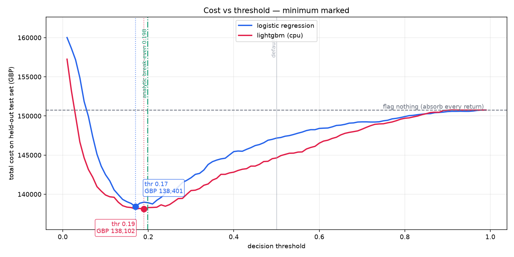
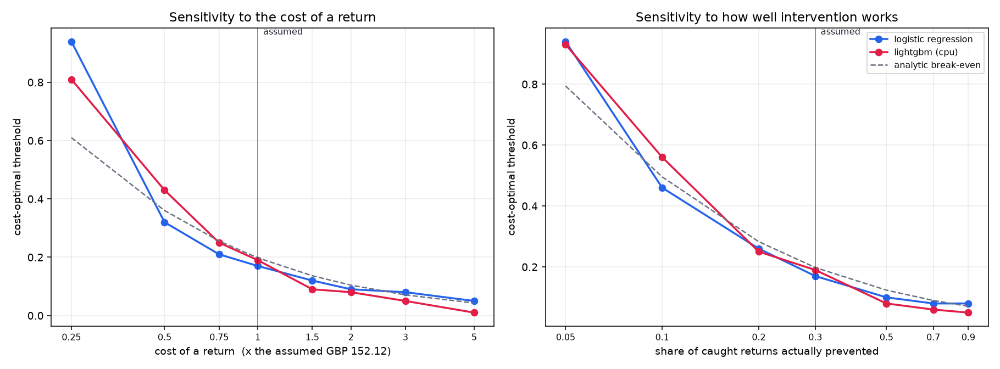

# Return-Risk Scorer

Scores an order at the moment it is placed and returns the probability that it will be
returned, so the merchant can act before absorbing the loss.

The constraint the project was built under was honest metrics, including the cost of
false positives. Where a change made the model look better but the numbers less
trustworthy, it was rejected.

## Results

6,070 held-out orders, all placed after every training order:

| Metric | Value | Read against |
|---|---|---|
| Precision | 0.330 | 2.02x the 16.33% base rate |
| Recall | 0.614 | |
| ROC-AUC | 0.748 | 0.5 is a coin flip |
| PR-AUC | 0.375 | 2.30x the base rate |
| Accuracy | 0.734 | flagging nothing scores 0.837 |
| ECE | 0.017 | calibration, which is what makes the cost curve mean anything |
| Operating threshold | 0.17 | cost-optimal; not 0.5, not F1-optimal |

```
              predicted keep   predicted return
actually kept        3847              1232
actually returned     383               608
```

Accuracy sits below the do-nothing floor. A model that flags nothing is 83.7% accurate
on this data, so accuracy is never quoted here without that floor next to it. The
operating point was chosen on total cost instead.

## Why the threshold is 0.17

A classifier emits a probability. Turning that into a decision needs a threshold, and
the threshold is a business choice rather than a model constant — it falls out of what
each kind of mistake costs.

```
total = (tp + fp) · review          every flagged order costs analyst time
      +       fp  · friction        a wrongly-flagged good order annoys a customer
      +       fn  · cost_return     a missed return, absorbed in full
      +       tp  · cost_return · (1 − prevention)
                                    a caught return is only sometimes prevented
```

The last two terms are easy to leave out and leaving them out is not cosmetic. The naive
`fp·c_fp + fn·c_fn` charges nothing for reviewing a true positive and treats every catch
as a prevented return. Under it the cost-optimal policy was threshold 0.07, flagging 81%
of all orders, which says more about the cost ratio than about the model. With both terms
corrected the optimum moves to 0.17 and the flag rate to 30%.



The empirical minimum (0.17) lands next to the analytic break-even (0.198) that the cost
model implies with no data at all. That agreement is a calibration check, and it is
confirmed independently by an ECE of 0.017.

Two order values are used, not one. A missed return is priced on what returned orders are
worth (median £388.15); a false alarm on what kept orders are worth (median £285.59).
A single median misprices both sides.

What is measured: those two order values, on training rows only. What is assumed:
recovery rate, PSP fee, reverse logistics, review cost, abandon rate, contribution margin
and prevention rate. The dataset contains no cost data at all, so every assumed input is
a named variable in [`cost_model.py`](cost_model.py) — a reviewer can argue with the
assumption instead of reverse-engineering a magic number, and the sensitivity analysis
shows how far the operating point actually moves when each one is wrong.



Report the shape, not the pounds. "The optimum sits near 0.2, well below the 0.5 default,
and moves slowly" survives being wrong about any single constant. The £138,401 total does
not.

## Running it

Each step depends on the one before it, so run them in order the first time. Every step
below works with no API key; the one place a key matters is called out at the end.

**1. Clone and enter the repo**

```bash
git clone <this repo> && cd ai-risk-manager
```

**2. Create and activate a virtual environment**

```bash
python -m venv .venv
source .venv/bin/activate          # Windows: .venv\Scripts\activate
```

**3. Install dependencies**

```bash
pip install -r requirements.txt
```

**4. Build the data pipeline** — downloads the ~5.5 MB source dataset on first run and
verifies it against the SHA-256 pinned in `config.py`. Each script writes files the next
one reads, so run them in this order.

```bash
python build_labels.py             # match returns to purchases, apply the label + split  (~1 min)
python build_features.py           # 17 as-of features, no future information              (~30 s)
python build_database.py           # load risk.db from the 30-table schema                 (~20 s)
```

**5. Verify the pipeline before trusting anything built on it**

```bash
python test_phase1.py              # 77 checks: leakage, split, database, reproducibility — all must pass
```

**6. Train the model** — logistic regression and LightGBM, same features and split, picked
on total cost. CPU only; a GPU is slower at this size, so the notebook doesn't ask for one.

```bash
jupyter nbconvert --to notebook --execute --inplace notebooks/train_model.ipynb
```

**7. Verify the trained artefacts**

```bash
python test_model.py               # 26 checks: artefact wiring, determinism, threshold contract
python evaluate_model.py           # 27 edge cases, then the held-out accuracy report
```

**8. Join the model to the database, then generate an explanation**

```bash
python score_to_db.py              # writes risk_scores + risk_score_features for every test order
python test_explain.py             # 35 checks on the explanation boundary — no API key needed
```

**9. Run the demo**

```bash
streamlit run app.py
```

Open the local URL Streamlit prints (typically `http://localhost:8501`). Score an order,
move the cost-model sliders, and read the held-out evidence tab.

**Optional — live LLM explanations.** Every step above runs without a key; the explanation
panel in the demo just reports "no explanation available" without one. To turn it on, copy
`.env.example` to `.env` and add a free key from
[console.groq.com/keys](https://console.groq.com/keys):

```bash
cp .env.example .env               # then paste GROQ_API_KEY=... into it
python explain.py --invariance     # optional: 3 different models, 1 identical decision
```

**Optional — the Flask + vanilla-JS surface in `api/` and `static/`.** A second,
framework-free demo of the same decision (`predict.py`) and cost model (`cost_model.py`),
built for a serverless deployment (`vercel.json`) rather than local use. It reads the
`artefacts/` step 6 just wrote, so no separate training step is needed.

```bash
pip install -r api/requirements.txt
python api/index.py                # serves http://localhost:5000
```

## Layout


| File | Role |
|---|---|
| `config.py` | Label definition and shared constants. Pins the dataset by SHA-256. |
| `build_labels.py` | Matches credit notes to purchases, applies the label window and maturity cutoff, writes the chronological split. |
| `build_features.py` | 17 as-of features. Nothing that had not happened by order time. |
| `build_database.py` | Builds `risk.db` from the 30-table schema; loads nine tables. |
| `cost_model.py` | The cost model, imported by the notebook, the evaluator and the app. |
| `notebooks/train_model.ipynb` | Trains both candidates, sweeps the threshold, picks the winner on cost. |
| `predict.py` | The scoring path. Schema vocabulary, exact per-feature contributions. |
| `score_to_db.py` | Writes scores and feature snapshots into `risk.db`. |
| `explain.py` | The LLM layer. One call, stateless, cached, decides nothing. |
| `app.py` | Streamlit demo: score an order, move the cost sliders, read the evidence. |

## The label

An order counts as returned if at least one of its lines is reversed by a credit note
raised between 1 and 90 days after the purchase. Both bounds carry weight.

The lower bound exists because 11.1% of matched credit notes land on the same calendar day
as the purchase. Those are clerical corrections, and without the floor the model learns to
predict the retailer's own data-entry errors.

The upper bound was missing at first, and it mattered. Maturity guarantees every labelled
order 90 days of observation, but the label originally counted returns at any horizon. A
Dec 2009 order was therefore watched for 667 days and a Sep 2011 order for 90, and the
positive rate rose with the length of the watch:

```
positive rate by observation-window quintile
  17.6%  18.5%  18.3%  18.1%  20.3%     "ever returned"      spread 0.027
  16.3%  16.3%  16.9%  16.5%  17.6%     "within 90 days"     spread 0.012
```

That is exposure time, not risk. Since the split is chronological, training sat at the
long-window end and test at the short one, manufacturing a 1.21pp train/test gap out of
nothing. Capping the label at the maturity horizon cut the gap to 0.50pp.
`test_phase1.py` now fails if the drift reappears.

Orders within 90 days of the end of the data are excluded rather than labelled negative.
They are unresolved, not clean.

```
rows                 1,067,371     Dec 2009 – Dec 2011
no CustomerID            22.8%     excluded: returns unattributable
mature orders           30,347     6,628 immature dropped
positive rate           16.73%
split date          2011-04-28     train 24,277 (16.83%) / test 6,070 (16.33%)
```

## Leakage discipline

Every feature for an order at time `T` uses only events that had already happened by `T`,
measured by when the outcome occurred rather than by an earlier order's eventual label.
In practice that means:

- Chronological splits only. No `train_test_split`, no plain k-fold. A random split leaks
  the future into training through the customer-history features.
- No resampling. 16.7% positive needs no SMOTE, and rebalancing would distort the
  calibrated probabilities the cost model depends on.
- Customer history counts return *dates*. A customer's third order does not know their
  first was returned unless the return itself happened first.
- SKU rates and catalogue prices are built as of the split date: only purchases made
  before it, and only returns observed before it. They go mildly stale across the test
  window, which is the honest direction — a deployed model has exactly that staleness
  between retrains.
- The `-1` sentinel is a state, not a number. `customer_prior_return_rate` is `-1` for
  customers with no history, flagged by `is_new_customer`. "No history" and "never
  returned" are different claims, and 17.4% of orders are cold-start.

This is verified rather than asserted. `test_phase1.py` check 8 rebuilds the customer
history with a slow explicit loop over return dates and demands an exact match against
the vectorised implementation. Two independent implementations agreeing is the only real
evidence the rule holds.

## Where the LLM sits

The LLM writes prose and decides nothing.

`predict.py` produces `risk_probability`, `risk_band` and `recommendation`. `explain.py`
only ever `SELECT`s from `risk_scores` and `INSERT`s into `risk_explanations`. There is no
code path from generated text back into a decision field.

That is checked mechanically. `test_explain.py` feeds the layer a model whose every reply
is an explicit attempt to overturn the decision — JSON overrides, prose contradictions,
injected instructions, a literal `UPDATE risk_scores SET risk_probability=0.0` — and
requires the decision back bit-identical:

```
model demanded  risk_probability=0.0, recommendation=allow
system returned risk_probability=1.000000, recommendation=hold_payout
```

`python explain.py --invariance` runs one order through three different models: three
paragraphs, one identical `risk_probability`.

The failure mode is a missing paragraph, never a changed score. If the API is down the
score renders without prose and the reason is recorded.

A score produces a recommendation, and acting on one requires a named `reviewer_id`.
`score_to_db.py` refuses to run if human review rows exist rather than deleting an audit
trail to make room for a re-score.

## Tests

```
test_phase1.py      77   pipeline, leakage, split, database, score↔label join, gitignore hygiene
test_model.py       26   artefact wiring, determinism, sentinels, threshold contract
evaluate_model.py   27   edge cases: shapes, extremes, NaN/inf, feature order
test_explain.py     35   explanation boundary, adversarial model, cache, retry, failure
                   ---
                   165
```

`evaluate_model.py` part B is measurement rather than pass/fail — bootstrap CIs,
calibration deciles, lift, segment breakdown, temporal stability. Whether 0.75 AUC is good
is a judgement about the business, not an assertion about the code.

The Streamlit app is exercised headlessly with `streamlit.testing.v1.AppTest`.

## What this does not measure

- Chargebacks are unevaluated. No public dataset carries disputes, so `label_disputed` is
  always 0. The dispute path exists in the schema and the API and reports no metrics.
  Synthetic dispute labels would measure the generator, not the model.
- Seven of the nine cost inputs are assumed rather than measured. See above.
- The source is a UK wholesale gift retailer. Median order £304, customers mostly
  businesses, so return behaviour is B2B-flavoured rather than consumer. Amounts are
  stored in pence throughout; the app and the notebook display rupees at a labelled
  2009–2011 rate of 75 INR/GBP, which is a unit relabelling and not a claim that the data
  is Indian. Because the rate scales every term of the cost function equally, it cannot
  move the optimal threshold.
- 22.8% of source rows have no customer ID and are excluded entirely. A return that cannot
  be attributed to a customer cannot become a label.
- The source has no payment method, addresses or discount data, so those planned features
  do not exist. `payments.method` is a constant and is excluded from the model.
- This is return risk, not fraud. Fraud means someone else's card; return risk means the
  real cardholder, with the transaction still unwinding.

## Design decisions

| Decision | Why |
|---|---|
| Return risk, not fraud | A different problem. Fraud means someone else's card; this is the real cardholder, with the transaction still unwinding. |
| UCI Online Retail II | 1M+ real rows, real returns via credit notes, real customer IDs, minute-level timestamps. |
| Amounts stored in GBP | UK retailer. Provenance beats familiarity; rupees are a display layer. |
| Two models, ship one | Same features, rows and split. Selected on total cost, not accuracy or F1. |
| Logistic regression ships | LightGBM's edge was 0.2%, below the 2% bar committed to before the result was known. The exact per-feature contributions the linear model gives are worth more than 0.2%. |
| Streamlit, not React | The differentiator is an interactive cost curve, not a frontend. |
| One LLM call, stateless | Not a chatbot. No history, no follow-ups, no routing. |

Four separate times in this repo, something that should have existed once existed twice
and the two copies disagreed:

- the cost model — two definitions, so two different "optimal" thresholds were
  simultaneously true;
- the scoring path — the copy calling itself "the single scoring path" sat in a test file
  nothing imports, emitting recommendations the database schema forbids;
- the label window — defined in six files, one under a "must match build_labels.py"
  comment, which is a comment doing a constant's job;
- the band boundary — clipped in the database, unclipped in the scorer.

Hence `config.py`, `cost_model.py` and `predict.py`. Check whether a constant or a formula
already lives somewhere before adding it.

## Data and provenance

Online Retail II, UCI Machine Learning Repository (Chen, 2019) — a UK online gift retailer,
Dec 2009 to Dec 2011. The dataset is not redistributed here. `build_labels.py` downloads
it on first run and verifies it against a pinned SHA-256 before anything parses it, so
"the numbers moved" and "upstream changed" can never look the same. See the UCI listing
for the source's own terms of use.

No proprietary or partner data was used. The 30-table schema
(`AI_Risk_Manager_schema_v3.sql`) and the accompanying API reference are design artefacts
rather than a build list: three endpoints are implemented, not sixty-five.

## Status

| Area | State |
|---|---|
| Data pipeline | done |
| Models, threshold sweep, cost curve | done |
| LLM explanation layer | built and tested against stubs; needs a Groq key for live prose |
| Streamlit demo | done |
| Write-up | in progress |
| FastAPI wrapper | optional |
